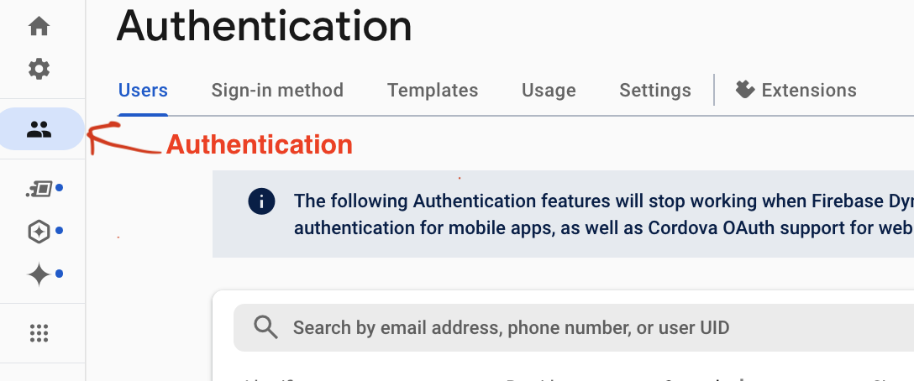
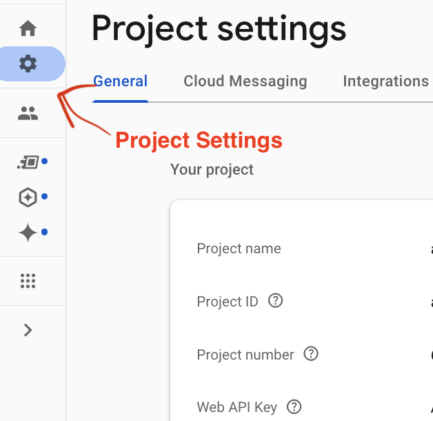
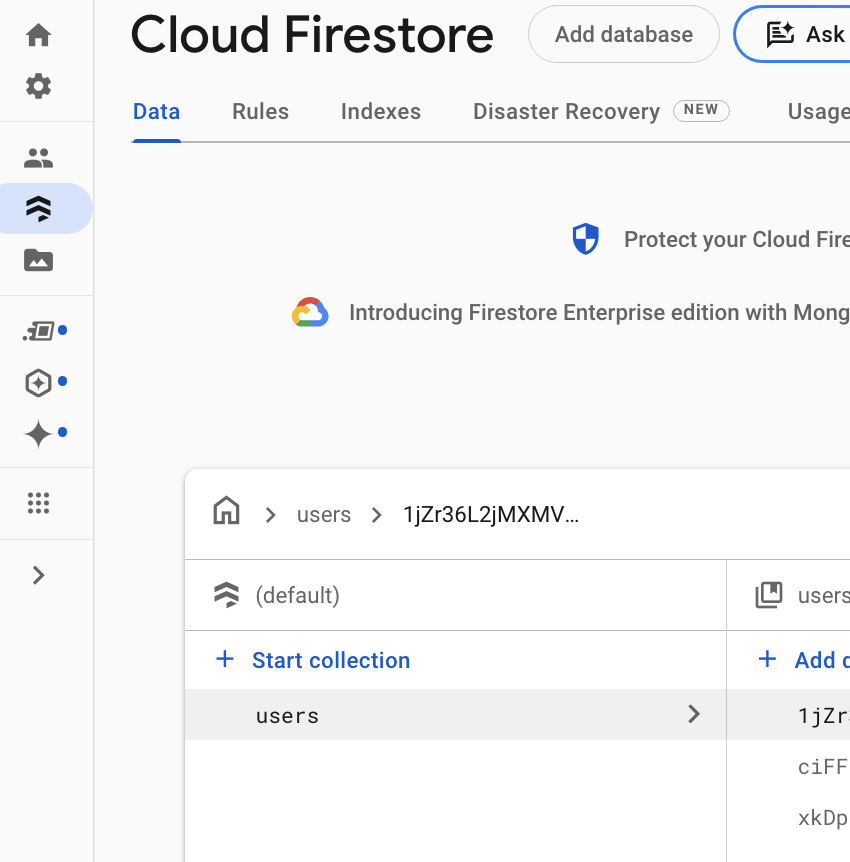
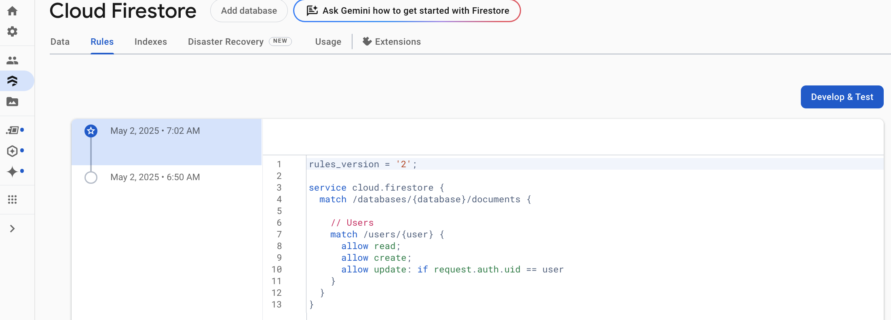
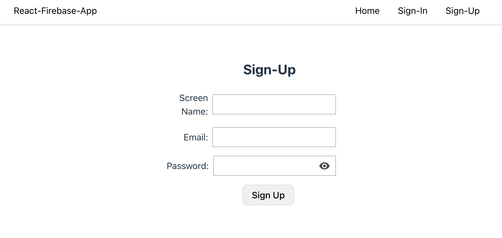
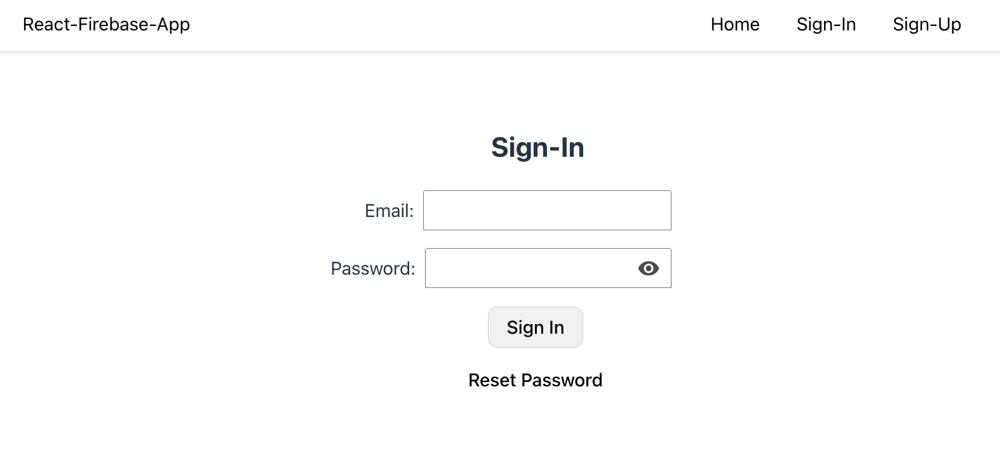
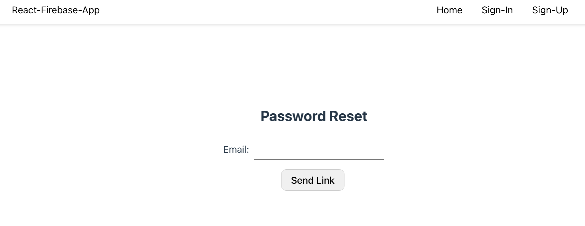

# React Firebase App with User Sign-in and Sign-up Management <!-- omit from toc -->

## Contents <!-- omit from toc -->

- [Abstract](#abstract)
- [Create the React App with Vite](#create-the-react-app-with-vite)
- [App Pages and Routes](#app-pages-and-routes)
- [Introduction to Firebase](#introduction-to-firebase)
- [Setup Firebase and Firestore](#setup-firebase-and-firestore)
- [Firebase Config](#firebase-config)
- [CSS Styling](#css-styling)
- [Header Page](#header-page)
- [Sign-up](#sign-up)
- [Sign-in](#sign-in)
- [Reset Password](#reset-password)
- [User Page Private Route](#user-page-private-route)
- [Connecting to a FastAPI Backend](#connecting-to-a-fastapi-backend)
- [Reference Blog Posts](#reference-blog-posts)

# Abstract

A fundamental requirement of commercial web applications is secure user sign-up and sign-in ("login") with secure authorization. React, the most widely adopted open-source JavaScript framework for building user interfaces, plays a central role in modern full-stack application development. Together, React, Firebase and FastAPI constitute a modern technology stack well-suited for building applications such as analytics platforms, dashboards, data exploration tools, and scientific or research-oriented applications where Python is preferred on the backend.

This repo demonstrates how to build a React application with user account creation, authentication using Firebase, and connecting with a fastAPI backend. It provides a realistic starting point for a full-stack Reat application with client-side user management features including sign-in, sign-up, password reset, and a protected user home page.

# Create the React App with Vite

Pre-requisites

- Node.js installed on your machine (on Mac install with "brew"). Installing Node will install `npm`, as it comes bundled with Node.js
- The code editor, VSCode is recommended

Next, create your react app from template, with `vite`. In a directory just above your desired project directory, create the application with the following shell command. This will create the project directory, e.g., `react_firebase` along with the default project files and structure.

```sh
$ npm create vite@latest react_firebase –template react

```

`Vite` is the recommended approach for creating your React app, starting with React 19. `Vite` offers the following advanatages

- faster and more streamlined development experience for modern web projects, including those using React.
- leverages native ES modules, eliminating the need for bundling during development and enabling near-instant server start and hot module replacement (HMR).
- For production builds, it uses Rollup, pre-configured for optimized static assets. Vite also offers built-in support for TypeScript, JSX, and CSS, reducing the need for extra configuration.

Next, cd to the project directory `cd react_firebase` and install Node package dependencies

```sh
$ npm install
```

Check the installed React version

```sh
$ npm list react
-----
react_firebase@0.0.0 /Users/username/workspaces/react_firebase
├─┬ react-dom@19.1.0
│ └── react@19.1.0 deduped
└── react@19.1.0
```

Start the dev server

```sh
$ npm run dev
```

In a web browser go to http://localhost:5173/ and you should see the Vite + React logos


The application's file/directory structure is as follows

```text
    - vite.config.js
    - index.html
    - package.json
    - src
        - App.css
        - App.tsx
        - index.dss
        - main.tsx
```

As compared to the `create-react-app`, the approach used before v19, there is now a`main.tsx` in the src directory instead of `index.jsx` and in the public directory `vite.svg`. We also see `vite.config.js` in the main project directory.

Notice that the App and main suffixes are changed `tsx` (manually changed, after the app creation) since our implementation will follow typescript conventions.

# App Pages and Routes

The goal for this app is managing user login with sign-in, sign-up and ulitmately, after sign-in, navigating the user to their User Page. We start by creating default apps pages: Home, Sign-in, Sign-up, Reset Password, and User Page.

The page links work as follows:

- The apps landing page, "/" is the Home Page. In a real application the Home Page contains content corresponding to the business.
- From the Home page, the user may choose to sign-in, or sign-up.
- From the Sign-in page, once signed-in, the user will automatically be directed to the User Page.
- Later we will create a protected route for the User Page, that is, the User page is only accessible if the user is signed-in.
- The Sign-up page enables the user to create an account with the application.
- A Reset Password page is accessable with a link from the Sign-in page.

THe content for these initial pages is an `h1` tag with the name of the page.

In order handle page routes in React we will install `react-router-dom` as follows.

```sh
$ npm install react-router-dom
```

Our initial app pages are listed in the code blocks below.

Main.tsx is the entry point for the `Vite-React` app. It imports App from App.jsx.

main.tsx

```JS
// main.tsx
import React from "react";
import ReactDOM from "react-dom/client";
import App from "./App.jsx";
import "./index.css";

ReactDOM.createRoot(document.getElementById("root")!).render(
  <React.StrictMode>
    <App />
  </React.StrictMode>
);
```

App.tsx is simplifed from the default setup. All the unnecessary `Vite-React` boiler plate is removed. App.tsx imports RouterProvider, and initializes it with the router defined in `routes.tsx`.

App.tsx

```JS
import React from "react";
import { RouterProvider } from "react-router-dom";
import "./App.css";
import router from "./router";

function App() {
  return (
    <>
      <RouterProvider router={router} />
    </>
  );
}

export default App;
```

The routes are defined in `routes.tsx` with `createBrowserRouter`, which creates a "Browser History" router. This "Browser History Router" supports HTML5 functionaly, via the HTML5 Browser History API. HTML5 supports features like detecting when the user pushes Back and Forward buttons, updating the URL without adding a new entry to the history, and changing the URL without reloading the page.

routes.tsx

```JSX
// routes.tsx
import React from "react";
import {
  createBrowserRouter,
  createRoutesFromElements,
  Route,
} from "react-router-dom";
import Home from "./pages/home";
import Signin from "./pages/signin";
import Signup from "./pages/signup";
import UserPage from "./pages/user";
import ResetPassword from "./pages/resetPassword";
import Header from "./components/header";

const router = createBrowserRouter(
  createRoutesFromElements(
    <Route path="/" element={<Header />}>
      <Route index element={<Home />} />
      <Route path="signin" element={<Signin />} />
      <Route path="signup" element={<Signup />} />
       <Route path="user_page" element={<UserPage />} />
      <Route path="reset_password" element={<ResetPassword />} />
    </Route>
  )
);

export default router;
```

The Header layout is defined in `components/header.tsx`. The `Outlet` component acts as a place holder for the child routes to be rendered (Home, Signin, Signup, and User Page).

```JS
//component/header.tsx

import { Link, Outlet } from "react-router-dom";
import React from "react";
function Header() {
  return (
    <>
      <nav>
        <p><Link to="/">Home</Link></p>
        <p><Link to="/signin">Sign In</Link></p>
        <p><Link to="/signup">Sign Up</Link></p>
      </nav>
      <div>
        <Outlet />
      </div>
    </>
  );
}
export default Header;
```

Each of our pages are definded within the `pages` subdirectory, as follows.

Home Page

```JS
// pages/home.tsx
import React from "react";

const Home = () => {
  return (
    <div>
      <h1>Home</h1>
    </div>
  );
};

export default Home;
```

The Sign-in page, at this point, contains an `<h1>` tag with the name of the page, and has a link to the Reset Passwor page.

Sign-in page

```JS
// pages/signin.tsx
import React from "react";

const Signin = () => {
  return (
    <div>
      <h1> Sign In</h1>
       <p> <Link to="/reset_password">Reset Password</Link>  </p>
    </div>
  );
};

export default Signin;
```

The Sign-up page like the remaining pages, has an `<h1>` tag with the name of the page, and no other content.

```JS
// pages/signup.tsx
import React from "react";

const Signup = () => {
  return (
    <div>
      <h1> Sign Up</h1>
    </div>
  );
};

export default Signup;

```

User Page

```JS
// pages/user_page.tsx
import React from "react";

const UserPage = () => {
  return (
    <div>
      <h1>User Page</h1>
    </div>
  );
};

export default UserPage;

```

Reset Password

```JS
// pages/resetPassword.tsx
import React from "react";

const ResetPassword = () => {
  return (
    <div>
      <h1>Reset Password</h1>
    </div>
  );
};

export default ResetPassword;

```

If it isn't already running, make sure your app is running - i.e., run $ `npm run dev` in the app root directory.

In your browser, go to the apps URL - http://localhost:5173/ and you should see links to each of the pages (Home, Signin, Signup) and the name of the page (as below).


# Introduction to Firebase

Before diving into the Firebause Auth setup, its useful to review and understand the overall Firebase features. Firebase is a comprehensiveaApp development service by Google hosted in GCP (Google CLoud Platorm). It provides a suite of tools and services to help developers build, improve, and grow web and mobile applications. Firebase is also compatable with other GCP features such as cloud functons which can trigger actions based on Firebase for easy integration of other cloud tools.

Below is a list of some of the features it offers

- SDKs for iOS, Android, and Web
- App Hosting
- Cloud Functions - Serversless backend logic triggered by Firebase features or HTTPS requests
- App Distribution - Distribute pre-release versions of your app to testers
- Firebase Authentication - secure sign-in with Email/Password, Google, Facebook, Apple, and more
- Firestore: NoSQL cloud real-time database that syncs data accross all clients in real-time
- Cloud Storage for firebase: Scalable object storage for images, videos, and other user-generated content.
- Google Analytics SUpport
- Crashlytics - real-time crash reporting tool
- Performance monitoring - measures your apps performance from the user's point of view
- Cloud Messaging (FCM) - push notifications for iOS, Android, and web
- Remote Config - support for dynamically changing your apps behavior
- A/B testing - for testing UI features
- ML toolkit - pre-built and custom machine-learning models for vision, text recognition, and translation.

It offers several high quality tools to support your applications.

In our example app (this repo) we will make use of the authentication. Later, as needed, additional Firebase tools can be added to the application.

# Setup Firebase and Firestore

In the GCP console, setup Firebasee and Firestore. Firebase Authentication will manage passwords and even provides the functionality for a user to update/reset a password. It is also typical to setup Firestore to hold customer details, for example, such as screenname, or other useful customer information. When it comes to "other customer details", Personal information management, security and privacy, is out of scope for our exercise, however the methods in this repo are still the basis of an app setup. Additional security and privacy procedurs can be implemented on top of this foundation.

Step-by-step setup

- Go to the Firebase console
  - Create a firebase project or use an existing firebase project.
  - Skip (unclick) Google Analytics for now. You can add it later if so desired.
- Go to your projects firebase console, then click on "All Products" on the left pane.
  

  - add email/password to the authentication methods
  - choose any other auth providers.
    

- Also, from the Firebase Products, create a Firestore database.
  - Test configuration (not production)
  - Create the User collection
  - For now, do not create any documents
  - After the app signs up a new user, the app will create a document for each user.



- In your project, firestore, click on rules, and add the following

```js
    // Users
    match /users/{user} {
    	allow read;
    	allow create;
    	allow update: if request.auth.uid == user
    }
```



- Next, click on the project settings button on the left and scroll down to the firebase config.

  - On the SDK Config, click on `config` and copy the secrets into your projects `.env` file. Follow the instructions below for setting up the `.env` file.

- In your projects root dicrectory create the `.env` to hold project secrets

  - Make sure `.env` is listed in your `.gitignore` so that the secrets do not get published to your repo
  - the `.env` file will include following entries. You will need to add the `VITE_` prefix for each keyname.

    ```JS
    //.env
    VITE_APIKEY=AIzaSyC6pPXXXXXXXXXXXXXXXXX
    VITE_AUTHDOMAIN=xxxxxxxxxxx.firebaseapp.com
    VITE_PROJECTID= xxxxxxxxx
    VITE_STORAGEBUCKET=xxxxxxxxxxx.appspot.com
    VITE_MESSAGINGSENDERID=372375xxxxxx
    VITE_APPID= 1:37237xxxx8:web:2fdxxxxxxxxxx278xxxd5
    ```

# Firebase Config

Next, we setup Firebase functionality in the App.
In the App directory, install the Firebase package.

```sh
$ npm install firebase
```

In addition to adding the Firebase package, this also will add Firebase to the `package.json`

In the applications src directory, Create `firebase-config.tsx` with the following contents.

```JS
//firebase-config.tsx
import { initializeApp } from "firebase/app";

//GetAuth Method is used to Configure our app to use Firebase Authentication
import { getAuth } from "firebase/auth";

import { getFirestore } from "firebase/firestore";

// TODO: Add SDKs for Firebase products that you want to use
// https://firebase.google.com/docs/web/setup#available-libraries

const firebaseConfig = {
  apiKey: import.meta.env.VITE_APIKEY,
  authDomain: import.meta.env.VITE_AUTHDOMAIN,
  projectId: import.meta.env.VITE_PROJECTID,
  storageBucket: import.meta.env.VITE_STORAGEBUCKET,
  messagingSenderId: import.meta.env.VITE_MESSAGINGSENDERID,
  appId: import.meta.env.VITE_APPID,
};

const app = initializeApp(firebaseConfig);

export const db = getFirestore();

export const auth = getAuth(app);

```

This file is similar to what you see in the Firebase settings page (GCP console); however, in our case, the environment secrets are read from the `.env` file. You do not want these secrets in your app code or they can be visible in the web console.

The comments about where to find additional Firebase libraries can be useful for the future.

In addition to initializing the application's environment variables, the code also imports getAuth, which supports login (sign-in), signout, and AuthStateChanged. The Auth service is initialized and exported so it is available anywhere in the application

The `import.meta.env.VITE_KEY` pattern is the method for importing build-time metadata (e.g.,environment variatbles). Vite requires the "`Vite_`" prefix is required to expose variables to the frontend.

In the src directory, create the `vite-env.d.ts` file with the following contents.

```js
/// <reference types="vite/client" />
```

This file provides type definitions that `Vite` needs to correctly undersatnd your project, such as in this case `import.meta.env`.

Restart your application and go the the apps url

http://localhost:5173/

# CSS Styling

Some basic styling for the app pages is added to `App.css`, beyond the default Vite-React styling. The styling provides a simple design style intended to be elegant in its simplicity. The main contribution of this repo is setting up user Firebase Auth and user management in the App, however some minimal styling is needed. This CSS based styling can be easily be removed and the styling upgraded to a different CSS framework.

CSS styles are added for

- Nav bar - a bar at the top of the page with links to other pages.
- Forms - a CSS forms layout that applies to all the forms in this App (Sign-in, Sign-up, Reset Password)
- Paragraph - hover functionality for links within a paragraph.

# Header Page

Our updated Header Page contains the navbar functionality needed to manage the user login including links to other pages.

```JS
// pages/Header.tsx
import React from "react";
import { Outlet, useNavigate } from "react-router-dom";
import { ToastContainer, toast } from "react-toastify";
import { auth } from "../firebase-config";
import { signOut } from "firebase/auth";

function Header() {
  const navigate = useNavigate();

  const handleSignOut = async () => {
    try {
      await signOut(auth);
      navigate("/"); // redirect after logout
    } catch (error) {
      toast.error("Error signing out:");
    }
  };

  const handleHome = () => {
    if (auth.currentUser) {
      navigate("/user_page");
    } else {
      navigate("/");
    }
  };

  const handleSignIn = () => navigate("/signin");
  const handleSignUp = () => navigate("/signup");

  return (
    <>
      <nav className="navbar">
        <div className="navbar-logo">
          <button onClick={handleHome} className="nav-button">
            React-Firebase-App
          </button>
        </div>
        <div className="navbar-links">
          <button onClick={handleHome} className="nav-button">
            Home
          </button>

          {auth.currentUser ? (
            <button onClick={handleSignOut} className="nav-button">
              Sign Out
            </button>
          ) : (
            <>
              <button onClick={handleSignIn} className="nav-button">
                Sign-In
              </button>
              <button onClick={handleSignUp} className="nav-button">
                Sign-Up
              </button>
            </>
          )}
        </div>
      </nav>
      <div>
        <Outlet />
      </div>

      <ToastContainer />
    </>
  );
}

export default Header;
```

The following functionality is noteable.

- If an error occurs, in Sign-out, a "Toast" notification is triggered. Install Toastify package in the app as follows.

  ```JS
  $ npm install react-tostify
  ```

- CSS `classNames` in the layout.
- The `Outlet` component is used to embed the corresponding page under the navbar
- `auth` is imported from `firebase-config`
- `sigOout` is imported from `firebase/auth`
- Several `Handle` submit functions are included for Home, Sign-up, Sign-in, and Sign-out.
- If the user is signed in (auth is not null) then the `Sign-out` link appears in the navbar, otherwise the `Sign-in` link appears in the navbar.
- Also, if the user is signed in they are directed to the User Page, otherwise the Apps Home Page.

Below is a screenshot of the new Header page with active page set to Sign-up. In the following sections we will discuss the details underlying the sign-up and other pages.



# Sign-up

The sign-up page includes a Form to sign-up a new user with their email and password. It should be straight forward to add additional functionality for signing up with another service, e.g., Gmail, etc.

```JS
// pages/signup.tsx
import React, { useState } from "react";
import { useNavigate } from "react-router-dom";
import { createUserWithEmailAndPassword, updateProfile } from "firebase/auth";
import { setDoc, doc, serverTimestamp } from "firebase/firestore";
import { auth, db } from "../firebase-config";

import { ToastContainer, toast } from "react-toastify";

import visibilityIcon from "../assets/visibilityIcon.svg";

const Signup = () => {
  const [email, setEmail] = useState("");
  const [screenName, setUserName] = useState("");
  const [showPassword, setShowPassword] = useState(false);
  const [password, setPassword] = useState("");
  const navigate = useNavigate();

  const handleSubmit = async (e: React.FormEvent) => {
    e.preventDefault();

    try {
      const userCredential = await createUserWithEmailAndPassword(
        auth,
        email,
        password
      );

      const user = userCredential.user;

      // this profile is local to client app not in cloud/firebase
      if (auth.currentUser) {
        await updateProfile(auth.currentUser, {
          displayName: screenName,
        });
      }

      //firestore
      const docData = {
        email: email,
        userName: screenName,
        timestamp: serverTimestamp(),
      };

      await setDoc(doc(db, "users", user.uid), docData);

      navigate("/");
    } catch (error) {
      // Add toast notification user feedback
      toast.error("Bad User Credentials");
    }
  };

  return (
    <div className="formContainer">
      <h1 className="formHeading">Sign-Up</h1>
      <form onSubmit={handleSubmit}>
        <div className="inputGroup">
          <label htmlFor="screenName">Screen Name:</label>
          <div className="inputAlign">
            <input
              type="text"
              className="inputField"
              id="screenName"
              value={screenName}
              onChange={(e) => setUserName(e.target.value)}
              required
            />
          </div>
        </div>
        <div className="inputGroup">
          <label htmlFor="email">Email:</label>
          <div className="inputAlign">
            <input
              type="email"
              className="inputField"
              id="email"
              value={email}
              onChange={(e) => setEmail(e.target.value)}
              required
            />
          </div>
        </div>

        <div className="inputGroup">
          <label htmlFor="password">Password:</label>
          <div className="inputAlign passwordInputContainer">
            <input
              className="inputField"
              type={showPassword ? "text" : "password"}
              id="password"
              value={password}
              onChange={(e) => setPassword(e.target.value)}
              required
            />
             setShowPassword((prev) => !prev)}
            />
          </div>
        </div>

        <div className="buttonAlign">
          <button type="submit">Sign Up</button>
        </div>
      </form>

      <ToastContainer />
    </div>
  );
};

export default Signup;
```

The following features are noteable in the code:

- the page layout is contained within a CSS defined `form Container`
- the sign-up form collects the users `screenName`, `email`, and `password`.
- `handleSubmit` processes the sign-up, including
  - `createUserWithEmailPassword` creates a new user.
  - authorization for the new user
  - a local (client side) profile for the user is created with the users screenName
  - Next, a new Firebase doc is created with the email and screenName
  - Finally, if there is an error a toast notification is displayed on the page.
  - A visiability icon, when clicked, will display the password as visiable text, otherwise the password text is hidden (displayed as asterisks: "\*\*\*\*").

# Sign-in



The Sign-in page collects the users email, password and seeks authorizaiton with Firebase. The page also includes a Reset Password link, allowing the user to reset their password.

```js
// pages/signin.tsx
import React, { useState } from "react";
import { Link, useNavigate } from "react-router-dom";
import { signInWithEmailAndPassword } from "firebase/auth";
import { ToastContainer, toast } from "react-toastify";
import { auth } from "../firebase-config";
import visibilityIcon from "../assets/visibilityIcon.svg";

const Signin = () => {
  const [email, setEmail] = useState("");
  const [showPassword, setShowPassword] = useState(false);
  const [password, setPassword] = useState("");
  const navigate = useNavigate();

  const handleSubmit = async (e: React.FormEvent) => {
    e.preventDefault();

    try {
      const userCredential = await signInWithEmailAndPassword(
        auth,
        email,
        password
      );

      if (userCredential.user) {
        navigate("/user");
      }
    } catch (error) {
      // Add toast notification user feedback
      toast.error("Bad User Credentials");
    }
  };

  return (
    <div className="formContainer">
      <h1 className="formHeading">Sign-In</h1>
      <form onSubmit={handleSubmit}>
        <div className="inputGroup">
          <label htmlFor="email">Email:</label>
          <div className="inputAlign">
            <input
              type="email"
              className="inputField"
              id="email"
              value={email}
              onChange={(e) => setEmail(e.target.value)}
              required
            />
          </div>
        </div>

        <div className="inputGroup">
          <label htmlFor="password">Password:</label>
          <div className="inputAlign passwordInputContainer">
            <input
              className="inputField"
              type={showPassword ? "text" : "password"}
              id="password"
              value={password}
              onChange={(e) => setPassword(e.target.value)}
              required
            />
             setShowPassword((prev) => !prev)}
            />
          </div>
        </div>

        <div className="buttonAlign">
          <button type="submit">Sign In</button>
        </div>
      </form>

      <ToastContainer />

      <p className="linkAlign">
        <Link to="/resetPassword">Reset Password</Link>
      </p>
    </div>
  );
};

export default Signin;
```

The Sign-in code is similar to that of the Sign-up page.

- The form is also contained within the CSS defined `formContainer`
- The form collects the users email and password and submits it to Firebase for authorizaiton.
- If the user authorization is successful then the user is navigated to the User Page.
- Otherwise, if there is a sign-in error then a toast notification is displayed on the page.

# Reset Password



The Reset Password page collects the users email. Firebase will send an email to the user allowing them to change their password.

```JS
// pages/resetPassword.tsx

import React, { useState } from "react";
import { ToastContainer, toast } from "react-toastify";
import { Link } from "react-router-dom";
import { getAuth, sendPasswordResetEmail } from "firebase/auth";

const ResetPassword = () => {
  const [email, setEmail] = useState("");

  const onChange = (e) => setEmail(e.target.value);

  const handleSubmit = async (e) => {
    e.preventDefault();
    try {
      const auth = getAuth();
      await sendPasswordResetEmail(auth, email);
      toast.success("Email sent");
    } catch (error) {
      toast.error("Could not send reset email");
    }
  };

  return (
    <div className="formContainer">
      <h2 className="formHeading">Password Reset</h2>
      <form onSubmit={handleSubmit}>
        <div className="inputGroup">
          <label htmlFor="email">Email:</label>
          <div className="inputAlign">
            <input
              type="email"
              className="inputField"
              id="email"
              value={email}
              onChange={(e) => setEmail(e.target.value)}
              required
            />
          </div>
        </div>

        <div className="buttonAlign">
          <button type="submit">Send Link</button>
        </div>
      </form>

      <ToastContainer />
    </div>
  );
};

export default ResetPassword;
```

The Reset Password code includes the following:

- the page layout is inside the "formContainer"
- The form collects the email
- a send link causes the email to be sent to Firebase, and if the email corresponds to a real user, a reset password link is sent.

# User Page Private Route

The private route functionality is added to the routes.tsx code. If the user is signed in they are directed to the `user_page` route.

```JS
// src/router.tsx
import React from "react";
import {
  createBrowserRouter,
  createRoutesFromElements,
  Route,
} from "react-router-dom";
import Home from "./pages/home";
import Signin from "./pages/signin";
import Signup from "./pages/signup";
import UserPage from "./pages/userPage";
import ResetPassword from "./pages/resetPassword";
import Header from "./components/header";
import PrivateRoute from "./components/pivateRoute";

const router = createBrowserRouter(
  createRoutesFromElements(
    <Route path="/" element={<Header />}>
      <Route index element={<Home />} />
      <Route path="signin" element={<Signin />} />
      <Route path="signup" element={<Signup />} />
      <Route path="reset_password" element={<ResetPassword />} />

      {/* Protect userPage route */}
      <Route element={<PrivateRoute />}>
        <Route path="user_page" element={<UserPage />} />
      </Route>
    </Route>
  )
);
```

The router imports a `privateRoute` component (./src/compoentns) If the user is signed in then access to the User Page is allowed, othwerwise the user is directed to the Sign-in page.

```JS
// src/components/PrivateRoute.tsx
import React, { useEffect, useState } from "react";
import { Navigate, Outlet } from "react-router-dom";
import { auth } from "../firebase-config";

const PrivateRoute = () => {
  const [loading, setLoading] = useState(true);
  const [isAuthenticated, setIsAuthenticated] = useState(false);

  useEffect(() => {
    const unsubscribe = auth.onAuthStateChanged((user) => {
      setIsAuthenticated(!!user); // true if user exists
      setLoading(false); // finished loading auth state
    });

    return unsubscribe; // cleanup listener on unmount
  }, []);

  if (loading) {
    return <div>Loading...</div>; // optional loading screen
  }

  return isAuthenticated ? <Outlet /> : <Navigate to="/signin" replace />;
};

export default PrivateRoute;
```

We don’t want to immediately redirect to /signin before Firebase has a chance to load, therefore `onAuthStateChanged` is detected because `auth.currentUser` is often null on first render. Firebase needs a moment to initialize the authentication state. Without it, protected routes may falsely redirect unauthenticated users even if they’re not logged in., This issue is fixed by listening for Firebase's auth state along with a loading indicator (or nothing, or a spinner) while waiting

# Connecting to a FastAPI Backend

To connect our React app functionality we deployed the fastAPI, described [here](https://github.com/Aljgutier/fastapi_docker/tree/main), to our local environment.

The User Page displays the Firebase user id. It sends an `http` request with an Autherization bearer token to the backend API. The backend in turn sends the token to Firebase, which returns the user id, and the backend sends the user id back to our frontend.

The User Page (listed below) listens for the users Auth state changes with `onAuthStateChange`. If the user is signed in then it displays the user id, otherwise it displays loading. The `unsuscribe` will cleanup after the `onAuthStateChange` listener unmounts.

```JS
import React, { useEffect, useState } from "react";
import { getUserId } from "../utils/backendTokenUserId";
import { auth } from "../firebase-config";
import { onAuthStateChanged } from "firebase/auth";

const UserPage: React.FC = () => {
  const [userId, setUserId] = useState<string | null>(null);

  useEffect(() => {
    const unsubscribe = onAuthStateChanged(auth, async (user) => {
      if (user) {
        try {
          const data = await getUserId();
          setUserId(data.id);
        } catch (error) {
          console.error("Error fetching user ID:", error);
        }
      }
    });

    return () => unsubscribe();
  }, []);

  return <div>User ID: {userId ?? "Loading..."}</div>;
};

export default UserPage;
```

To send the Auth token to the backend and get the user id, the User Page makes use of our `auth` function in `../firebase-config.tsx`. It also imports a new function `getUserId` in `../utils/backendTokenUserId"`.

```JS
// src/utils/backendTokenUserId.tsx

import { getAuthToken } from "./getAuthToken";

// returns userId from token
import axios from "axios";
import { auth } from "../firebase-config";

const BASE_URL = import.meta.env.VITE_BACKEND_URL;

export const getUserId = async (): Promise<any> => {
  const user = auth.currentUser;

  if (!user) {
    throw new Error("No authenticated user");
  }

  const token = await getAuthToken();

  const response = await axios.get(`${BASE_URL}/userid`, {
    headers: {
      Authorization: `Bearer ${token}`,
    },
  });

  return response.data;
};
```

In order to know the backend URL, add the following environment variable to the `.env`.

```sh
...
VITE_BACKEND_URL=http://localhost:8000
```

Of course, change the `BACKEND_URL` to your deployed backend as required.

The `getAuthToken` method (below) calls Firebase to get a token and the token is then sent in the Authorization header to the backend `/userid` route, which then returns the user id in its response.

```JS
//utils/getAuthToken.tsx
import { auth } from "../firebase-config";

export const getAuthToken = async (): Promise<string> => {
  const user = auth.currentUser;
  if (!user) throw new Error("No authenticated user");
  return await user.getIdToken();
};

```

We chose the 3rd party Axios library to send the `http` requests over the native Fetch library for the following reasons:

- Axios automatically parses JSON — no need for response.json()
- It throws an error on non-2xx status codes, making it easier catch errors
- it automatically rejects promises for HTTP error status codes

As usual, install Axios with npm.

```sh
$ npm import axios
```

You can test the functionality by signing into the app, signing in, and after sending the Auth token to the backend, and receiving userid from the backend it will display the user id.

# Reference Blog Posts

I began tyring to setup a React-Firebase-FastAPI app by readng a few blog posts. No one source fullfilled all the requirements, however, the following two articles were helpful.

- [Firebase Authenticaion in the Backend](https://medium.com/@gabriel.cournelle/firebase-authentication-in-the-backend-with-fastapi-4ff3d5db55ca)
- [Firebase Authenticaion with React](https://medium.com/@amamit/firebase-authentication-with-react-2ac170996ae0)
